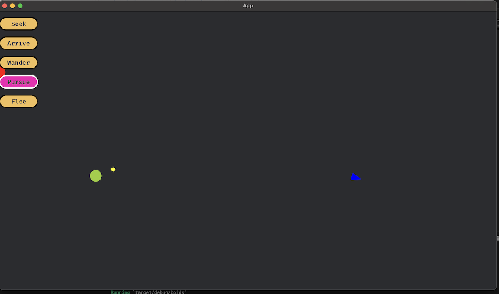

# Boids

Steering behaviour implementation using Bevy, Avian2d and Rust.

Based on [Coding Train](https://thecodingtrain.com/tracks/the-nature-of-code-2/)/[Nature of Code](https://natureofcode.com/autonomous-agents) and Reynold's steering behaviours.

## Running

- `cargo run`

The main window shows buttons with options to change the steering behaviour. Most behaviours will target the mouse position (eg seek and arrive), and the ship is constrained to a smaller area in the middle of the screen.

## Structure

Most of the steering behaviour code is in `steering_plugin.rs`. The other files set up the window and handle things like moving the mouse around.

## Behaviours

- Seek
- Arrive
- Wander
- Flee
- Pursue
